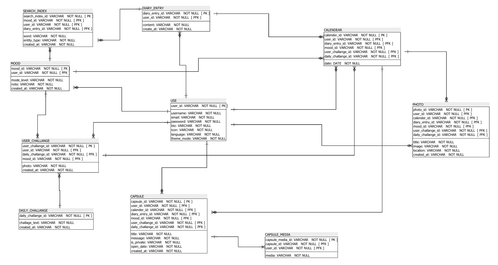

# Quivio Backend API

A personal lifestyle journaling platform backend built with FastAPI that helps users track moods, write daily diaries, complete photography challenges, and create time-locked memories.

## Features

- **Authentication System** - JWT-based user registration and login
- **Daily Mood Tracking** - 5-level mood scale with notes
- **Diary Entries** - Daily journaling with word count tracking
- **Challenge System** - Mood-based photography challenges
- **Timeline Views** - Calendar and map visualization of entries
- **User Management** - Profile settings and statistics

## Tech Stack

- **Framework:** FastAPI (Python 3.11+)
- **Database:** SQLite (development) / PostgreSQL (production ready)
- **Authentication:** JWT tokens with refresh capability
- **Image Storage:** Cloudinary integration (partial)

## Installation

### Prerequisites
- Python 3.11 or higher
- pip or virtualenv

### Setup

1. **Clone the repository**
   ```bash
   git clone <my-repo-url>
   cd Quivio-backend
   ```

2. **Create virtual environment**
   ```bash
   python3 -m venv venv
   source venv/bin/activate
   ```

3. **Install dependencies**
   ```bash
   pip install -r requirements.txt
   ```

4. **Environment configuration**
   ```bash
   cp .env.example .env
   ```

5. **Initialize database**
   ```bash
   alembic -c alembic/alembic.ini upgrade head
   python -c "from app.services.challenge_service import ChallengeService; from app.database import SessionLocal; db = SessionLocal(); ChallengeService.create_sample_challenges(db); db.close()"
   ```

6. **Run the application**
   ```bash
   uvicorn app.main:app --reload --host 0.0.0.0 --port 8000
   ```

## API Documentation

Once running, visit:
- **Interactive API Docs:** http://localhost:8000/docs
- **ReDoc Documentation:** http://localhost:8000/redoc
- **OpenAPI JSON:** http://localhost:8000/openapi.json

## API Endpoints

### Authentication
- `POST /auth/register` - Register new user
- `POST /auth/login` - Login user
- `POST /auth/refresh` - Refresh JWT token
- `GET /auth/me` - Get current user info

### Daily Entries
- `POST /daily/mood` - Create/update daily mood
- `POST /daily/diary` - Create/update daily diary
- `GET /daily/{date}` - Get entries for specific date
- `GET /daily/mood/{date}` - Get mood for specific date

### Challenges
- `GET /challenges/daily` - Get today's challenge based on mood
- `POST /challenges/complete/{challenge_id}` - Complete a challenge
- `GET /challenges/history/me` - Get challenge history
- `GET /challenges/stats/me` - Get challenge statistics

### Timeline
- `GET /timeline/calendar/{year}/{month}` - Get calendar data
- `GET /timeline/map` - Get photo locations for map
- `GET /timeline/search?q=term` - Search diary entries
- `GET /timeline/entry/{date}` - Get complete entry details

### Users
- `GET /users/profile` - Get user profile
- `PUT /users/profile` - Update user profile
- `POST /users/change-password` - Change password
- `GET /users/stats` - Get user statistics

## Database Models

### Core Models
- **User** - User accounts with preferences
- **Mood** - Daily mood entries (1-5 scale)
- **DiaryEntry** - Daily text entries with word count
- **Photo** - Photo memories with location data
- **DailyChallenge** - Photography challenge templates
- **UserChallenge** - User's challenge attempts
- **Capsule** - Time-locked memories (planned feature)

### Entity Relationship Diagram (ERD)


### Key Features
- One mood and diary entry per user per day
- Entries can only be edited until 11:59 PM
- Challenges are assigned based on mood level
- All user data is properly isolated

## Configuration

### Environment Variables
```env
# Database
DATABASE_URL=sqlite:///./quivio.db

# Security
SECRET_KEY=your-secret-key-here
ALGORITHM=HS256
ACCESS_TOKEN_EXPIRE_MINUTES=30

# Cloudinary
CLOUDINARY_CLOUD_NAME=your-cloud-name
CLOUDINARY_API_KEY=your-api-key
CLOUDINARY_API_SECRET=your-api-secret

# CORS
CORS_ORIGINS=["http://localhost:3000"]
```

## Development

### Database Migrations
```bash
# Generate new migration
alembic -c alembic/alembic.ini revision --autogenerate -m "description"

# Apply migrations
alembic -c alembic/alembic.ini upgrade head
```

### Testing
```bash
# Run with test database
DATABASE_URL=sqlite:///./test.db uvicorn app.main:app --reload
```

### Code Structure
```
app/
├── api/endpoints/     # API route handlers
├── core/             # Core configuration and security
├── models/           # SQLAlchemy database models
├── schemas/          # Pydantic request/response models
├── services/         # Business logic layer
├── utils/            # Helper utilities
├── database.py       # Database connection setup
└── main.py          # FastAPI application entry point
```

## Current Limitations

- Photo upload requires Cloudinary setup
- Capsules system not fully implemented
- Map functionality requires photo location data
- Statistics return basic data only
- No email functionality for password reset

## Production Deployment

### Docker Setup
```bash
# Build image
docker build -t quivio-backend .

# Run container
docker run -p 8000:8000 quivio-backend
```

### PostgreSQL Migration
1. Update DATABASE_URL in environment
2. Install PostgreSQL adapter: `pip install psycopg2-binary`
3. Run migrations: `alembic upgrade head`

## Contributing

1. Fork the repository
2. Create a feature branch
3. Make your changes
4. Add tests if applicable
5. Submit a pull request


## Support

For issues and questions:
- Check the API documentation at `/docs`
- Review the database schema in `app/models/`
- Ensure all environment variables are properly set